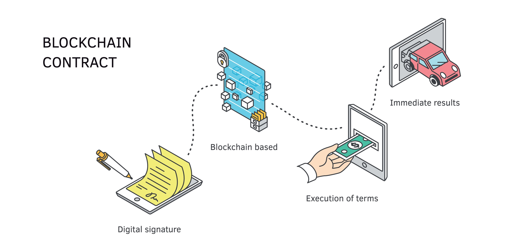

# few-payments

A Java 25 payment simulator for **$FEW**, focusing on advanced transactionality, Virtual Threads, and Blockchain integration via Geth.

> [!IMPORTANT]
> **To HR Managers and IT Recruitment Teams:**
> This documentation is subject to continuous development and real-time updates. As this is a live technical log of the project's evolution, please be patient with any potential delays or ongoing revisions! 🙏

## 📚 Project Documentation

* [Session 1 & 2: Workstation & Runtime Setup](./docs/SETUP_LOG.md)
* [Session 3: Spring Boot & Docker Infrastructure](./docs/SETUP_SPRING_LOG.md)
* [Session 4: Spring Boot & DB](./docs/SETUP_DB_LOG.md)
* [Session 5: Test Container](./docs/SETUP_TEST_CONTAINER_LOG.md)
* [Session 6: Blockchain Strategy](./docs/SETUP_BLOCKCHAIN_LOG.md)
* [Session 7: Bridge Spring Blockchain](./docs/SETUP_BRIDGE_SPRING_BLOCKCHAIN_LOG.md)
* [Session 8: Test DB Blockchain](./docs/SETUP_TEST_DB_BLOCKCHAIN_LOG.md)
* [Session 9: Test Transfer Wallet](./docs/SETUP_TEST_TRANSFER_WALLET_LOG.MD)
